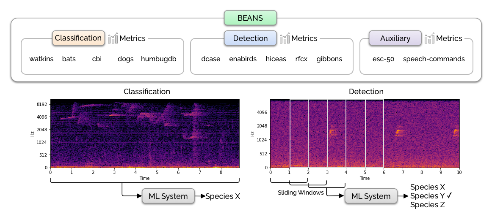

# BEANS: The Benchmark of Animal Sounds



BEANS (the BEnchmark of ANimal Sounds) is a collection of bioacoustics tasks and public datasets, specifically designed to measure the performance of machine learning algorithms in the field of bioacoustics. The benchmark proposed here consists of two common tasks in bioacoustics: classification and detection. It includes 12 datasets covering various species, including birds, land and marine mammals, anurans, and insects. See [our paper](https://arxiv.org/abs/2210.12300) for more details.

This repository contains the code for downloading the datasets and running the baselines.

## Installation

1. Create a conda environment

```
conda create -n beans python=3.8 pytorch cudatoolkit=11.3 torchvision torchaudio cudnn -c pytorch -c conda-forge
```

2. Install the dependencies and the benchmark itself

```
pip install -r requirements.txt
pip install -e .
```

BEANS uses SoX for pre-processing some datasets. For Ubuntu/Debian you can install it via:

```
sudo apt-get install sox
sudo apt-get install libsox-fmt-mp3
```

3. The benchmark also relies on a few Kaggle datasets. Install the Kaggle CLI via `pip install kaggle` and make sure to put your API token in `~/.kaggle/kaggle.json`. You will also need to go to the individual competition pages (namely, [cbi](https://www.kaggle.com/c/birdsong-recognition) and [rcfx](https://www.kaggle.com/c/rfcx-species-audio-detection)) and choose "late submission" in order to download their datasets.

4. Download the dataset by running the following script. It also runs a Python script which verifies the MD5 hashes of all the data files. Note that you'll need about 300GB of disk space for storing the original and the processed datasets.

```
scripts/download_data.sh
```

If the data download and validation finish successfully, you'll see a `Validation succeeded!` message.

## Running the benchmark

You can run all the baseline models by running:

```
python run_benchmark.py
```

This will write result files into the `logs` directory.

## Implementing your own model

Implementing new models on BEANS is easy! You'll need to make a few changes in the code:

* Implement your PyTorch model in [beans/models.py](https://github.com/earthspecies/beans/blob/main/beans/models.py) by inheriting from `nn.Module`. Make sure your `forward()` method returns the loss and the logits. See the existing model implementations.
* Add model initialization code in the `train_pytorch_model()` method in [scripts/evaluate.py](https://github.com/earthspecies/beans/blob/main/scripts/evaluate.py#L142). You may also need to modify the `main()` method, [especially the `ArgumentParser` part](https://github.com/earthspecies/beans/blob/main/scripts/evaluate.py#L238) so that the script takes the new model name and parameters from the command line arguments.
* Make sure you feed the correct audio representations to the model ([scripts/evaluate.py](https://github.com/earthspecies/beans/blob/main/scripts/evaluate.py#L265)). Currently BEANS supports raw waveform, mel-spectrograms, and MFCCs, which can be controlled by the `feature_type` parameter [passed to the dataset](https://github.com/earthspecies/beans/blob/main/beans/datasets.py#L103).
